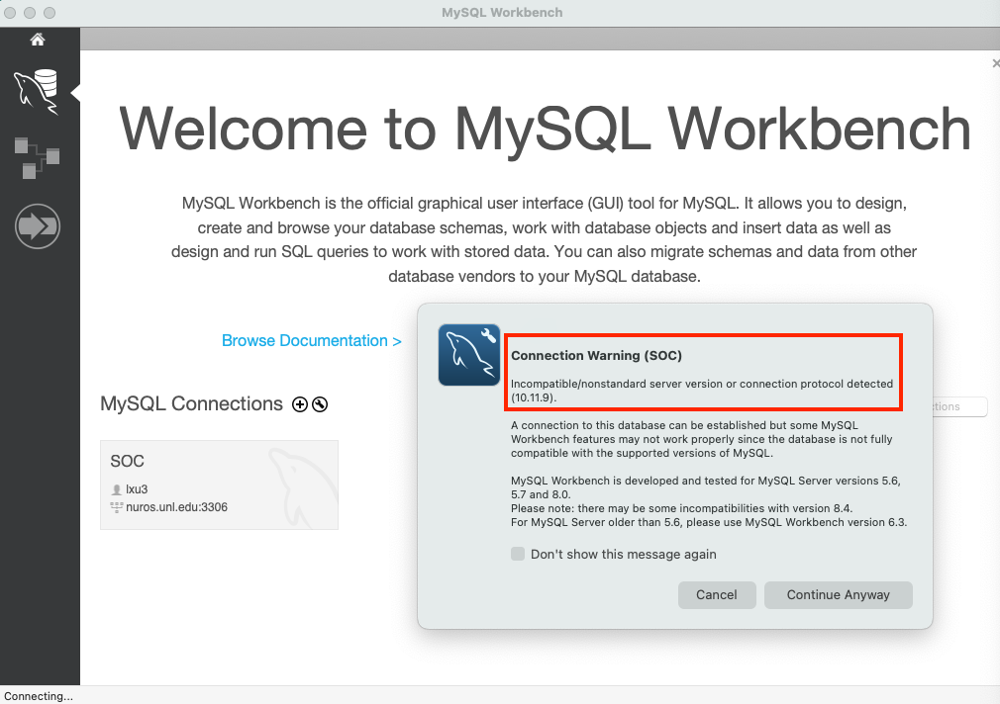

# Computer Science II
## Lab 5.0 - MySQL IDE

Install the MySQL IDE and test your MySQL username and password.

This is a lab used in Computer Science II (CSCE 156) for Fall 2024 
in the [School of Computing](https://computing.unl.edu) 
at the [University of Nebraska-Lincoln](https://www.unl.edu).

## Overview

   
### Lab Objectives & Topics

Following the lab, you should be able to:

-   install the MySQL IDE
  
-   connect to a MySQL server using your MySQL username and password

### Peer Programming Pair-Up

At the start of each lab, you may find a team member by yourself or may be randomly paired up with another student by
a lab instructor.  One of you will be designated the *driver* and the other the *navigator*. Each week you should try to alternate: if you were a driver last week, be a navigator next, etc. If you prefer to work on this lab by yourself, that is fine too. 

## 1. Install MySQL Workbench

MySQL Workbench is a free Integrated Development Environment (IDE) for MySQL.  You can download and install
MySQL Workbench at the following URL.

https://www.mysql.com/products/workbench/
    

## 2. Connect to a MySQL server on a Linux server

We connect to the MySQL server running on a Linux server of the School of Computing.

1. Find the email about your MySQL username and password, which was sent to you several weeks ago.

2. Run the MySQL Workbench that you just installed

3. Create a new MySQL connection by clicking the plus sign 

  

4. Type the hostname ***`nuros.unl.edu`***, your MySQL username (for example, my MySQL username is lxu3), and a connection name (for example, SOC). We use the default port number 3306. Then click the "OK" button.

  

5. Click to open the MySQL connection that we just created 

  

6. Type your MySQL password 

  

7. If you see a "Connection Warning" window, just click the "Continue Anyway" button  

  

  But if you see a "Cannot Connect to Database Server" window, then one of the following information is wrong
* hostname must be `nuros.unl.edu`
* username must be the username in the email sent to you
* password must be the password in the email sent to you

  

8. Then you are successfully connected to the MySQL server. 

  

## 3. Activities 

1. Type a use statement: `use`, a space, your MySQL username, and a semicolon. For example, because my MySQL username is `lxu3`, I type the statement `use lxu3;` as shown in the blue box of the following screenshot.

2. After typing the above statement, click the flash icon in the red box of the screenshot to execute the statement.

3. If the use statement executes successfully, you should see something similar to the output in the green box of the screenshot.

  

## 4. Submission on Canvas

* Please take a screenshot of the output of the use statement, and upload it to Canvas.
* You do not need to submit any code to GradeScope for this lab. 
